# Sistemes client-servidor amb PostgreSQL

## Objectiu de la pràctica

Documentaré y ensenyare com he preparat un sistea client-servidor amb PostgreSQL, l'ojectiu és tenir una màquina que fa de servidor, on està instal·lat PostgreSQL i la base de dades `dvdrental`, i una altra màquina que fa de client, des d’on em connecto al servidor per fer consultes, he provat diferents formes de connexió: amb `psql`, amb pgAdmin i amb DBeaver.

## Entorn utilitzat

He fet servir dues màquines:

```text
asgbd-server-oc amb la ip 192.168.1.111
asgbd-client-oc amb la ip 192.168.1.110
```

El servidor és la màquina on he instal·lat PostgreSQL 18 i on he carregat la base de dades `dvdrental` i el client és la màquina des d’on he provat la connexió remota amb `psql`, pgAdmin i DBeaver, he començat comprovat que el client podia fer connexió al servidor amb `ping` i també que podia entrar per SSH sense cap problema.

```bash
hostname
ip -br a
ping -c 4 192.168.1.111
ssh ocreus@192.168.1.111
```

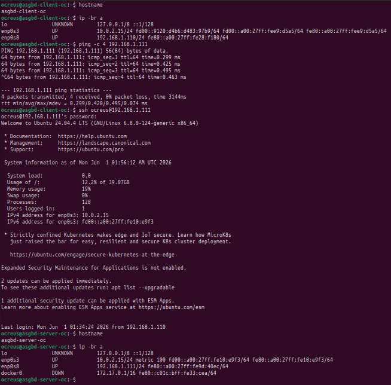

Aqui he fet las comprobacions, des de `asgbd-client-oc` puc fer ping al servidor `192.168.1.111` i també puc entrar per SSH a `asgbd-server-oc`.

## Instal·lació de PostgreSQL 18 al servidor

Al servidor he instal·lat PostgreSQL 18, i per mirar la versió i el estat del servei he fet:

```bash
psql --version
sudo pg_lsclusters
sudo ss -tulpn | grep postgres
```

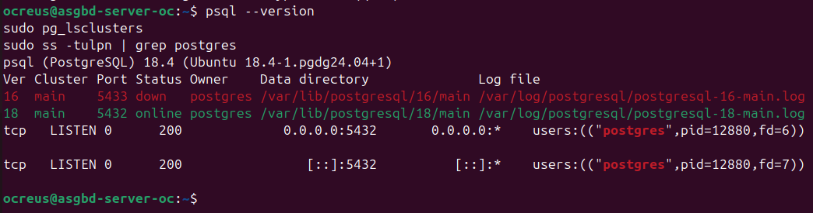

En aquesta captura es veu que el servidor té PostgreSQL `18.4` instal·lat i funcionant pel port `5432`, a més hi ha un PostgreSQL 16, però no l’estic fent servir en aquesta pràctica peque utilitzo la versió 18.

## Càrrega de la base de dades dvdrental

Per fer proves he utilitzat la base de dades `dvdrental`, i el ficher `dvdrental.tar` el tenia descarregat al client i me'l vaig passar al servidor amb `scp`, per després, al servidor, crear la base de dades i restaurar el fitxer:

```bash
sudo -u postgres dropdb --if-exists dvdrental
sudo -u postgres createdb dvdrental
sudo -u postgres pg_restore -d dvdrental dvdrental.tar
```

Per comprovar que s’havia pujat bé sense errors vaig mirar les taules i vaig fer algunes peticions:

```bash
sudo -u postgres psql -d dvdrental -c "\dt"
sudo -u postgres psql -d dvdrental -c "SELECT COUNT(*) FROM film;"
sudo -u postgres psql -d dvdrental -c "SELECT title FROM film LIMIT 5;"
```

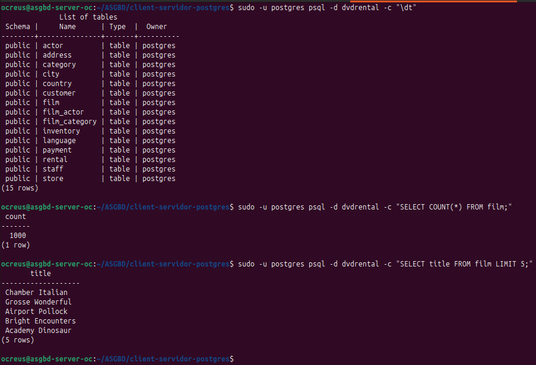

Podem veure a la captura que la base de dades té 15 taules, que la taula `film` té 1000 registres i que les consultes tenen dades sense nulls ni errors.

## Connexió local amb psql

Primer he provat la connexió local al servidor fent servir l’usuari del sistema `postgres` amb:

```bash
sudo -u postgres psql -d dvdrental
```

Cuan he entrat, he fet aquestes consultes:

```sql
SELECT COUNT(*) FROM actor;
SELECT first_name, last_name FROM actor LIMIT 5;
```

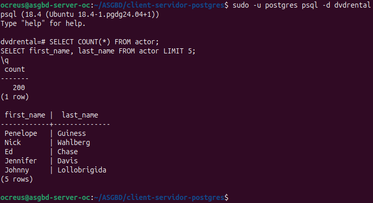

He pogut entrar a `dvdrental` des del mateix servidor i fer consultes sobre la taula `actor`.

## Connexió amb localhost

Després he volgut provar una connexió amb usuari i contrasenya, fent servir `localhost`, avans de fer res li he posat una contrasenya igual que el nom de l’usuari `postgres`:

```sql
ALTER USER postgres WITH PASSWORD 'postgres';
```

Després he entrat amb:

```bash
psql -h localhost -U postgres -d dvdrental
```

I he fet consultes:

```sql
SELECT first_name, last_name FROM actor LIMIT 5;
SELECT title FROM film LIMIT 5;
```

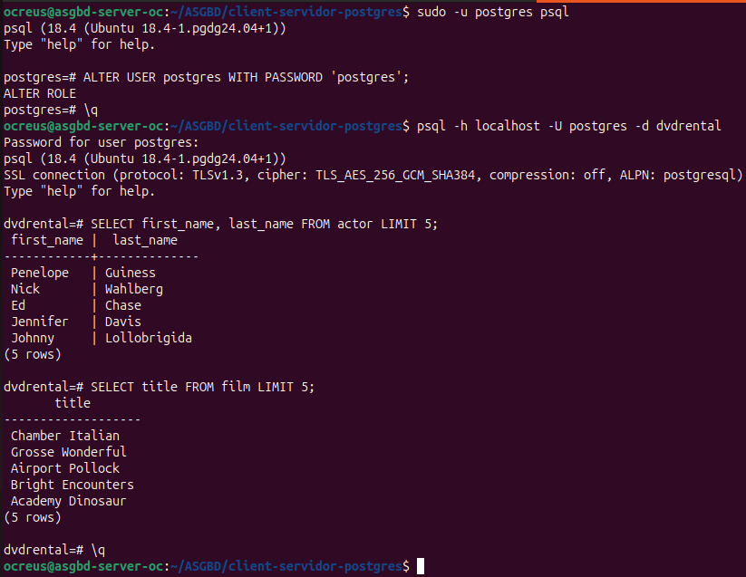

Aqui com un client que es connecta al servidor PostgreSQL amb usuari i contrasenya.

## Configuració de connexions remotes

Per poder fer la connexió des del client al servidor, he modificat la configuració de PostgreSQL, al fitxer:

```text
/etc/postgresql/18/main/postgresql.conf
```

he deixat aquesta línia:

```conf
listen_addresses = '*'
```

Això fa que PostgreSQL escolti connexions que no siguin només de `localhost`, he modificat també el fitxer:

```text
/etc/postgresql/18/main/pg_hba.conf
```

Aqui he afegit una regla al final del ficher, per deixar fer connexions des de la xarxa interna:

```conf
host    all     all     192.168.1.0/24     scram-sha-256
```

Després he reiniciat PostgreSQL per aplicar els cambis:

```bash
sudo systemctl restart postgresql
```

I he comprovat la configuració amb:

```bash
sudo grep "listen_addresses" /etc/postgresql/18/main/postgresql.conf
sudo tail -n 5 /etc/postgresql/18/main/pg_hba.conf
sudo ss -tulpn | grep :5432
```

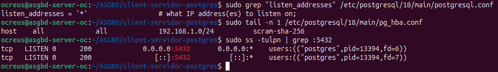

PostgreSQL escolta a totes les adreces, accepta connexions des de la xarxa `192.168.1.0/24` i el port `5432` està obert i escoltant sense ningun problema.

## Connexió remota des del client

Després he provat la connexió del `asgbd-client-oc` al servidor, al client he executat:

```bash
psql -h 192.168.1.111 -U postgres -d dvdrental
```

I dintre de la base de dades he fet:

```sql
SELECT title FROM film LIMIT 5;
SELECT COUNT(*) FROM customer;
```

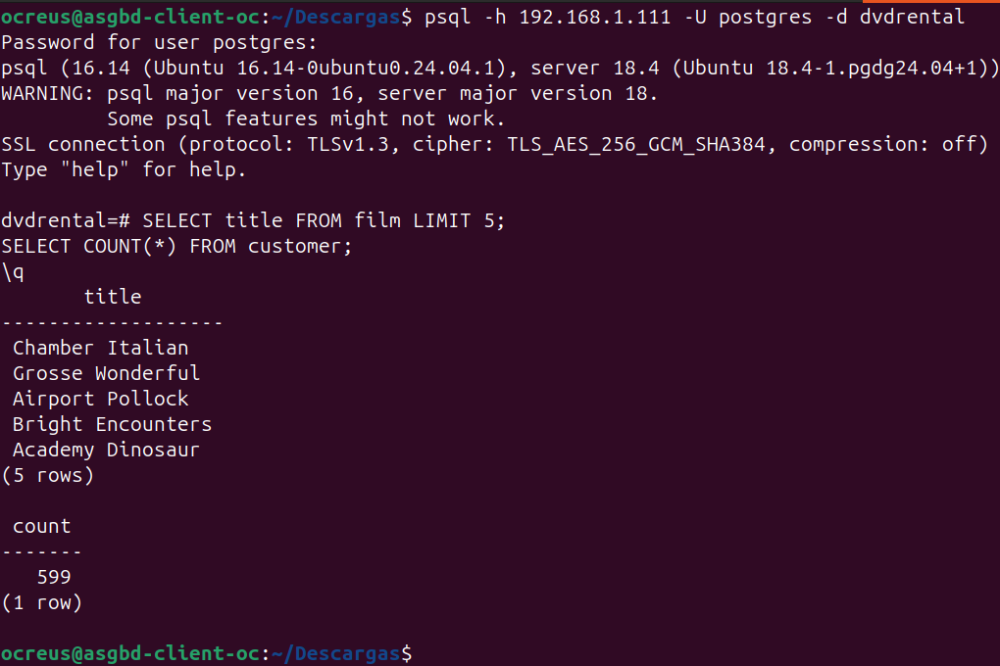

Aquesta és una prova, que demostra que el client pot connectar-se al servidor PostgreSQL per xarxa, surt un avís perquè el client `psql` és versió 16 i el servidor és versió 18, però les consultes funcionen perfecte, osigui que no ens hem de preocupar.

## Instal·lació i accés a pgAdmin

També he instal·lat pgAdmin al servidor i hi he accedit des del Firefox del client amb:

```text
http://192.168.1.111/pgadmin4
```

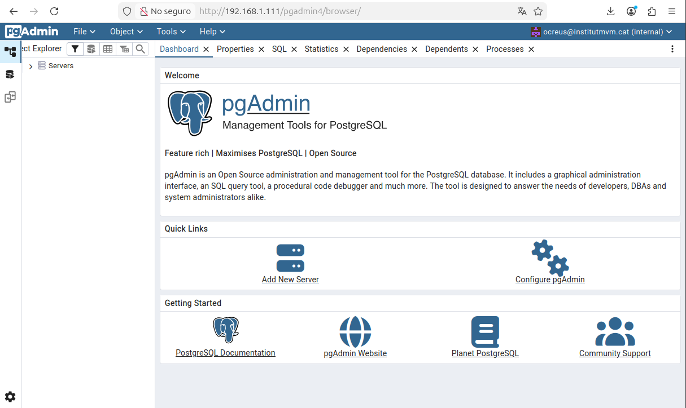

pgAdmin funciona perfecte i puc accedir des del navegador.

## Connexió a PostgreSQL amb pgAdmin

Dins de pgAdmin he "creat" el servidor PostgreSQL amb aquests parametres:

```text
Host: 192.168.1.111
Port: 5432
Database: dvdrental
Username: postgres
Password: postgres
```

Un cop ha fet conexió he obert el Query Tool i he executat:

```sql
SELECT title FROM film LIMIT 5;
```

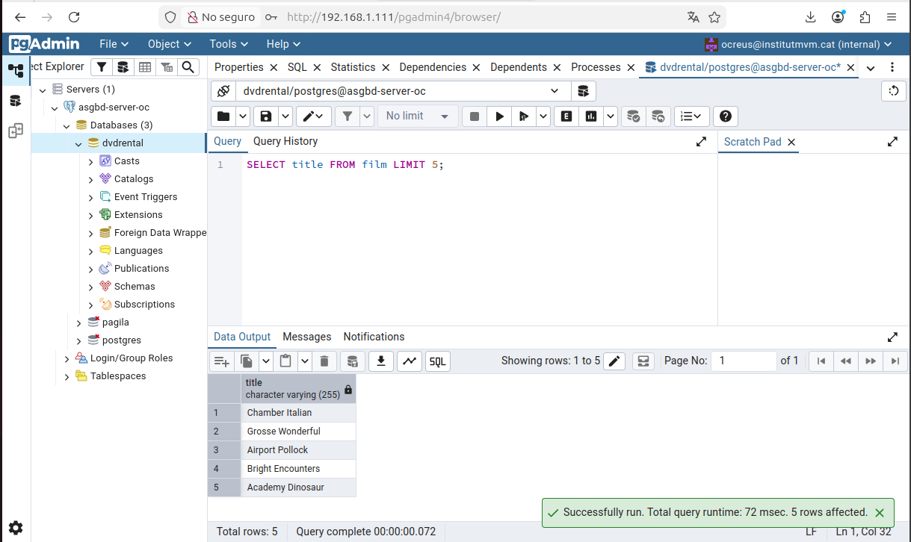

Aqui pgAdmin està connectat a la base de dades `dvdrental` i la consulta funciona sense cap problema.

## Instal·lació de DBeaver al client

He instal·lat DBeaver a la màquina client.

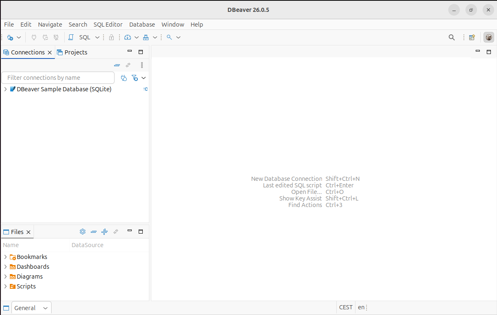

Aqui DBeaver esta obert al client, al principi només apareixia la base de dades d’exemple de DBeaver, així que vaig crear una connexió nova a PostgreSQL.

## Connexió a PostgreSQL amb DBeaver

A DBeaver he creat una connexió nova amb aquesta info:

```text
Host: 192.168.1.111
Port: 5432
Database: dvdrental
Username: postgres
Password: postgres
```

Després he fet una consulta:

```sql
SELECT title FROM film LIMIT 5;
```

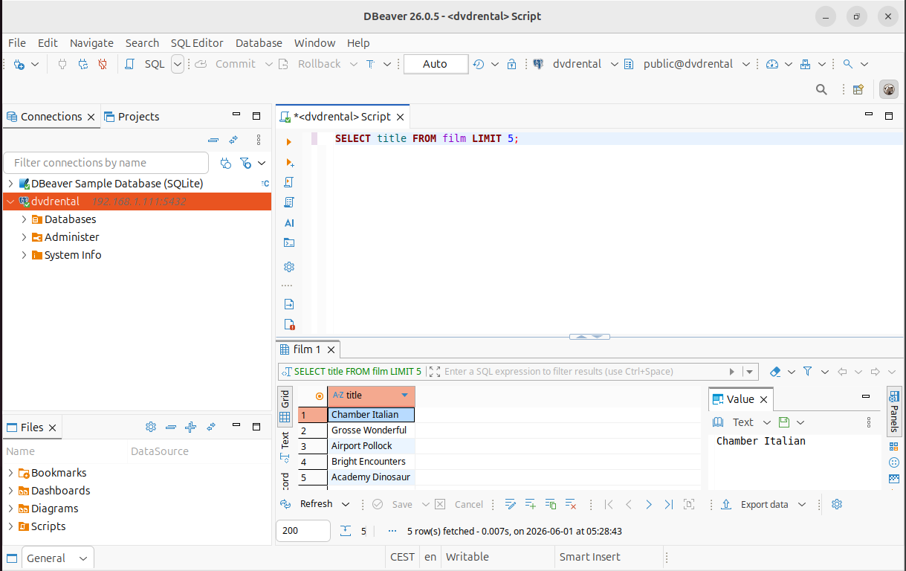

He connectat DBeaver al server PostgreSQL i la consulta sobre la taula `film` funciona perfecte.

## Preguntes de l’activitat

### PostgreSQL és centralitzat o client-servidor?

PostgreSQL funciona com un sistema client-servidor per tant el servidor és qui guarda i gestiona la informació, i els clients es connecten al servidor per fer consultes osigui `asgbd-server-oc` tenia PostgreSQL i la base de dades `dvdrental`, pero `asgbd-client-oc` es connectava amb `psql`, pgAdmin i DBeaver.

### Aquesta pràctica és de 2 capes o de 3 capes?

En principi és una arquitectura de 2 capes hi ha una capa, el client, que pot ser `psql`, pgAdmin, i la segona capa és el server PostgreSQL, per la base de dades i com no hi ha com un intermediari entre client i servidor això no és una arquitectura de 3 capes.
